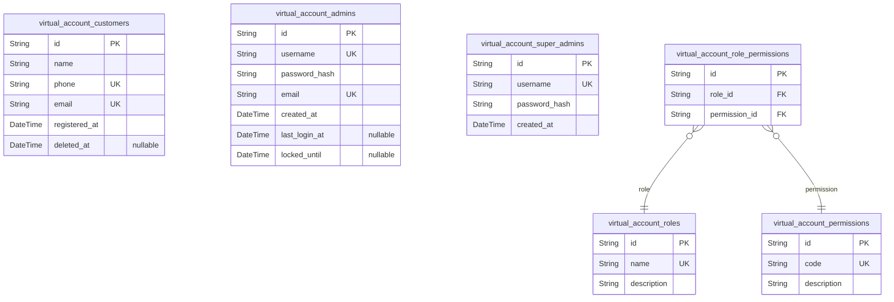
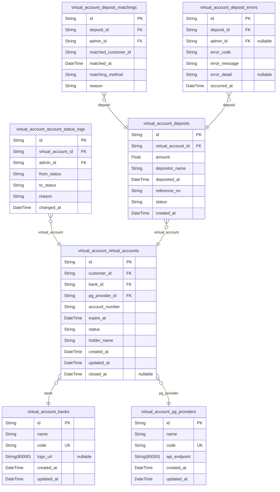
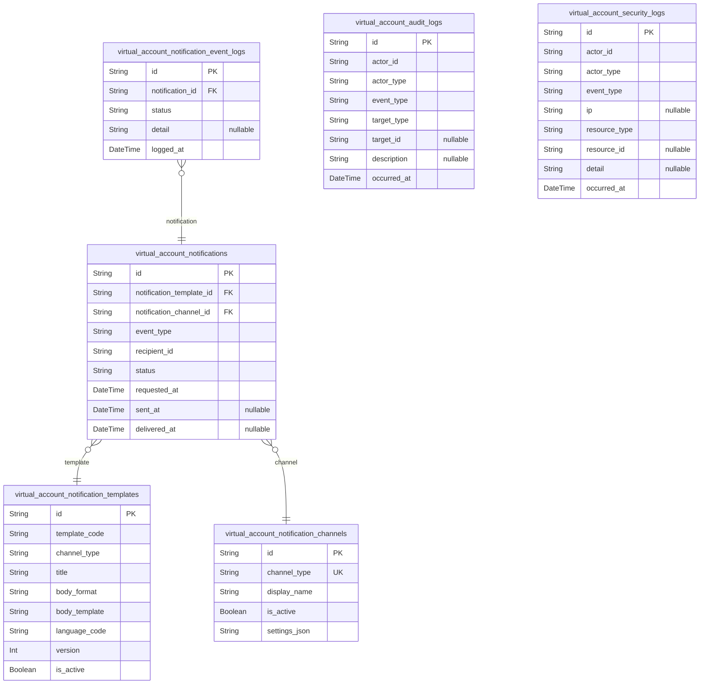
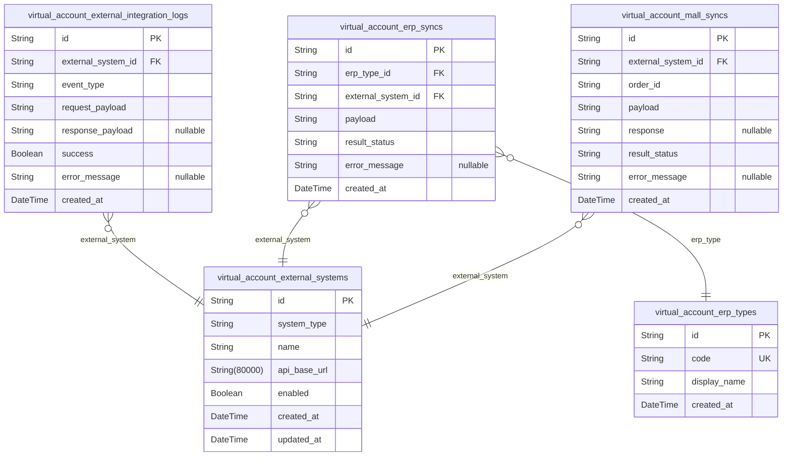
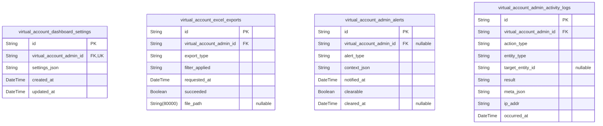
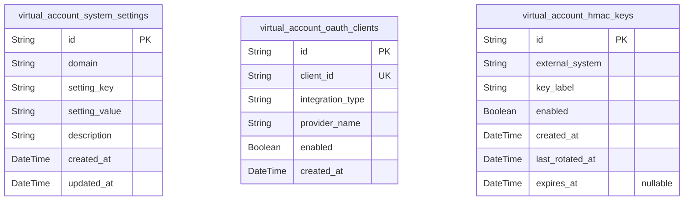
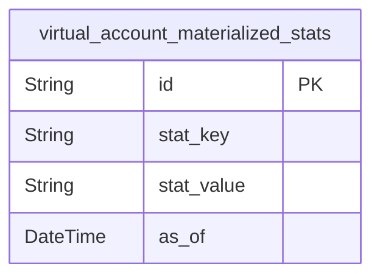

# Prisma Markdown

> Generated by [`prisma-markdown`](https://github.com/samchon/prisma-markdown)

- [Core](#core)
- [AccountsAndDeposits](#accountsanddeposits)
- [NotificationsAndLogs](#notificationsandlogs)
- [ExternalIntegration](#externalintegration)
- [AdminDashboardAndSettings](#admindashboardandsettings)
- [UtilityAndConfig](#utilityandconfig)
- [default](#default)

## Core

### `virtual_account_customers`

Customer information for virtual account issuance and deposit tracking - Implements the customer registration and KYC requirements from the requirements report (see '고객 등록', '주요 사용자 및 역할').

Customers are the primary end-users of the virtual account system. This model holds personal and contact details (name, phone/email), registration data, and references for subsequent account/transaction linkage. Maintains strict 3NF normalization with separate linking to roles and activity logs. For example, it's used whenever a new service registration or account issuance is initiated. 

Key relationships: to issued virtual accounts, deposits, notifications, and activity logs. Special behaviors: ensures unique identification and secure, normalized personal data storage.

Properties as follows:

- `id`: Primary Key. Unique identifier for a customer.
- `name`: Customer's full name - Implements the basic KYC registration requirement. Stores the person name atomically for identification. Example: '홍길동'. Must be present for every customer.
- `phone`: Customer's primary phone number - Implements contact verification requirement. Example: '010-1234-5678'. Normalized as a single value.
- `email`: Customer's main email address - Implements contact/alarm requirements. Used for notifications, password reset, and 2FA. Example: 'hong@test.com'.
- `registered_at`: Date/time of customer registration - Implements audit/tracing of service initiation requirement. Example: '2025-04-01T15:23:00+09:00'. 3NF: does not pre-calculate any durations.
- `deleted_at`: Soft deletion timestamp - Implements retention and deletion compliance requirements. Null unless account is deleted. 3NF compliance, nullable field.

### `virtual_account_admins`

Administrator user information for virtual account management system. Implements requirements for role-based secure admin management from administrator/슈퍼관리자 roles in requirements analysis.

Admin accounts have audit/admin privileges over customer, account, deposit and notification activities. Maintains strict 3NF and links to role/permission management. For example, whenever a dashboard login occurs, or account status is updated, this model is referenced.

Key relationships: roles, activity logs, 2FA records. Special behaviors: login, password reset, admin lockout policies enforced.

Properties as follows:

- `id`: Primary Key. Unique identifier for an admin user.
- `username`: Administrator login name - Implements secure admin/authentication requirements. Must be unique, 3NF: atomic login ID.
- `password_hash`: Hashed password for admin authentication - Implements PW/2FA compliance. Never stores plain password. 3NF compliant; hash only.
- `email`: Admin email for alerts and reset - Implements notification and security policies. Used for e.g. 2FA, system alerts. Must be unique for admins.
- `created_at`: Admin account creation timestamp - For audit trail and security reporting. Example: '2025-06-01T13:00:00+09:00'. 3NF, not calculated. Used in logins and account audits.
- `last_login_at`: Last login time for the admin user. Implements compliance and monitoring requirements. Null if never logged in. 3NF (never pre-computes durations).
- `locked_until`: Account lockout timestamp. Implements login security, lockout after failed logins, etc. Null if not locked. 3NF compliant.

### `virtual_account_super_admins`

Super admin (root) account list - Implements the optional 'super administrator' role for total platform policy management (See requirements section '슈퍼관리자(선택적)').

Has the highest privileges: managing admin roles, audit policies, system settings. Strictly normalized and isolated for extra security. Used for system-level actions and on-boarding new admins. Referenced when privilege delegation, emergency actions, policy changes are logged.

Key relationships: to admin/role audit logs. Special behavior: extreme restrictions, single or minimal rows expected.

Properties as follows:

- `id`: Primary Key. Unique identifier for the super admin.
- `username`: Super admin login name - Implements root-level authentication. Unique value. 3NF: atomic per super admin.
- `password_hash`: Password hash for super admin login - Never stores plain text password, for compliance. 3NF, hash only.
- `created_at`: Super admin account creation timestamp. For audit/logging only. 3NF only (no derived values).

### `virtual_account_roles`

Role types for RBAC - Implements the role/permission separation requirement across admins/super admins outlined in the requirements (see '권한 및 역할 관리').

Defines roles such as ordinary admin, super admin, audit viewer, etc. Normalized, with join-table to permissions. Used whenever access is checked for any admin action or UI section. 

Key relationships: to admins, role-permission links. Special behaviors: strictly assigned to users, not containing calculated or redundant fields.

Properties as follows:

- `id`: Primary Key. Unique role identifier.
- `name`: Role name (e.g. ADMIN, SUPER_ADMIN, AUDITOR) - Implements the requirement for explicit named roles per RBAC. Unique/atomic. Example: 'ADMIN'.
- `description`: Role description - Explains scope/limitations of the role as required for audit and onboarding. Does not duplicate other info; 3NF compliant.

### `virtual_account_permissions`

Permission (action/capability) definitions for RBAC - Implements the fine-grained action/permission requirement outlined in '권한 및 역할 관리'.

Normalizes all possible platform permissions (e.g. VIEW_DASHBOARD, MANAGE_CUSTOMERS, EXPORT_EXCEL) for assignment to roles. Used in evaluating/assigning privilege for every admin action.

Key relationships: to roles via role-permission join table. Special: maintained as a unique normalized catalog of permissions. Usage: permission assignment, audit, onboarding.

Properties as follows:

- `id`: Primary Key. Unique permission identifier.
- `code`: Permission code (e.g. VIEW_DASHBOARD) - Implements explicit permission control per RBAC/requirement. Must be unique. Example: 'VIEW_DASHBOARD'.
- `description`: Permission description - Explains business use and scope. Example: '권한 없는 화면 접근시 오류 발생'. 3NF compliant documentation.

### `virtual_account_role_permissions`

Join table for role-permission (M:N) mapping - Implements normalized M:N assignment from RBAC rules ('권한 및 역할 관리' section of requirements).

Ensures 3NF/bridge table between roles and permissions: For example, allows 'ADMIN' role to be mapped to multiple permissions, and same permission assigned to multiple roles. Used when admins are checked for permissions, or permission assignment screens/audit logs.

Key relationships: role → M:N → permission. Special: field-level uniqueness and no redundant/cached data (enforced by composite unique index).

Properties as follows:

- `id`: Primary Key. Unique link for each assignment of role-permission.
- `role_id`: Reference to the target role - Links to [virtual_account_roles.id](#virtual_account_roles) per M:N design.
- `permission_id`: Reference to the permission - Links to [virtual_account_permissions.id](#virtual_account_permissions) per M:N design.

## AccountsAndDeposits

### `virtual_account_banks`

[Bank Master Table] - This implements the requirement from the external integration and account issuance documentation for managing supported banks for virtual accounts. 

This model records all banks that can provide virtual accounts through API integration. Maintains 3NF by storing only atomic banking details with no duplication. For example, used when listing banks for new virtual account issuance, and during bank code mapping for deposits. 

Key relationships: referenced by virtual accounts for provider identification.
Special behaviors: Banks are referenced as foreign keys; cannot be deleted if linked to an account.

Properties as follows:

- `id`: Primary Key. Unique identifier for bank master record.
- `name`: [Bank Name] - Implements bank descriptive naming requirement. Stores the display name shown to users and admins; required for clear account identification. Ensures 3NF; no calculated values. Example: 'KEB 하나은행'
- `code`: [Bank Code] - Required for external integration with PG/bank API and unique mapping. Stores standard banking code; must be unique. Example: '004' for KB.
- `logo_url`: [Bank logo URI] - Implements branding requirement. Stores image/logo URI for UI/UX display. Remains atomic and non-redundant; example: used on virtual account selector.
- `created_at`: [Created Timestamp] - Implements audit trail and reporting requirement. Records when the bank entry was added. Never null. Example: new provider onboarding date.
- `updated_at`: [Updated Timestamp] - For record modification audit. Non-nullable to ensure full audit.

### `virtual_account_pg_providers`

[PG Provider Master Table] - Implements requirement for managing all virtual account-enabled payment gateways (PGs) in the system, e.g., KG이니시스, Toss Payments. 

Purpose: Track supported PG providers available for account issuance and deposit APIs. Maintains 3NF by only storing atomic and provider-specific info. Used for: PG provider selection during account issuance and reporting. Relations: Referenced by virtual_account_virtual_accounts table. 

Special behaviors: Cannot be deleted if virtual accounts reference this row.

Properties as follows:

- `id`: Primary Key. Unique identifier for the PG provider.
- `name`: [Provider Name] - Implements requirement for descriptive naming; e.g., 'KG이니시스'. Used for selection and listings. 3NF; never calculated.
- `code`: [Provider Code] - Implements API reference requirement. Used as code on API calls; e.g., 'KG', 'TOSS'. Must be unique.
- `api_endpoint`: [API Endpoint URI] - Implements provider API connection config. Stores external endpoint for integration; 3NF-compliant. For example: used in account issuance polling.
- `created_at`: [Created Timestamp] - Tracks when provider was onboarded; for audits. Example: contract/registration date.
- `updated_at`: [Updated Timestamp] - Tracks last update to provider info. Required for system health checks.

### `virtual_account_virtual_accounts`

[Virtual Account Base Table] - Implements requirement for tracking all virtual accounts issued by the system per customer, per bank, and per PG. Maintains 3NF by storing only atomic account attributes. Example: used when querying account list, matching incoming deposit, auditing issuance records.

Key relationships: references customers, banks, PG providers; referenced by status logs, deposits.
Special behaviors: Expired/finished accounts soft-marked, never physically deleted.

Properties as follows:

- `id`: Primary Key. Unique ID for each issued virtual account.
- `customer_id`: References the customer who owns the virtual account; target: virtual_account_customers.id. Fulfills customer-account connection requirement for issuance/matching/audit.
- `bank_id`: References external bank; target: virtual_account_banks.id. Required for mapping account to bank for integration/API.
- `pg_provider_id`: References PG provider; target: virtual_account_pg_providers.id. Ensures every account is linked to origin PG for webhook/API updates.
- `account_number`: [Account Number] - Implements virtual account number issuance, matches external format. 3NF, always unique in combination with bank/PG.
- `expire_at`: [Valid Until] - Records expiry date/time for virtual account. Used for invalidation/cleanup/alerts. Not calculated, atomic datetime only.
- `status`: [Account Status] - Implements lifecycle state such as 'ACTIVE', 'EXPIRED', 'CLOSED'. Required for dashboard/status change. 3NF; single value only.
- `holder_name`: [Account Holder Name] - Stores name displayed as account owner. Used for recipient matching. Never calculated, non-null.
- `created_at`: [Issued Timestamp] - Audit info of when the account was created/issued.
- `updated_at`: [Last Modified Timestamp] - Audit info for status or info edits. Not null.
- `closed_at`: [Closed Timestamp] - Set when account is expired/finished. Used for stats and reporting. Null when account is open.

### `virtual_account_account_status_logs`

[Account Status Change Log] - Implements audit and regulatory requirement for recording every status transition (e.g., activate, expire, close) on a virtual account. 

3NF is guaranteed by normalizing log per event; never includes calculated/summary fields. Used when tracking account lifecycle changes for auditing/system tracing.

Key relationships: references virtual_account_virtual_accounts and admin (actor).

Properties as follows:

- `id`: Primary Key. Unique key for status log.
- `virtual_account_id`: References the virtual account; implements per-account audit logging. Target: virtual_account_virtual_accounts.id.
- `admin_id`: References the admin who performed the status change. Implements actor audit. Target: virtual_account_admins.id.
- `from_status`: [Old Status] - Records pre-change status. E.g., 'ACTIVE'. Ensures all transitions are atomic records only, fully normalized.
- `to_status`: [New Status] - New status after change. Used in transition tracking. Example: 'EXPIRED'.
- `reason`: [Change Reason] - Implements requirement to provide reason for change (free text). Atomic string; example: 'expired by bank'.
- `changed_at`: [Status Changed Timestamp] - Exact time status changed. No calculated field. Required for sequential status history.

### `virtual_account_deposits`

[Deposit Event Table] - Implements requirement for logging every incoming deposit to any virtual account; never stores summaries, only atomic events. 3NF compliance is met by logging one row per real deposit event, no aggregation.

Business context: Core of auto-matching, alarm, ERP integration. Example: every webhook from PG/bank creates a row here.

Key relationships: References virtual_account_virtual_accounts, used in matching, error, notification modules.

Properties as follows:

- `id`: Primary Key. Unique row for deposit event.
- `virtual_account_id`: References the virtual account related to this deposit. Used for matching and statistics. Target: virtual_account_virtual_accounts.id.
- `amount`: [Deposit Amount] - Atomic value of money incoming. Must be exact match for auto-matching. Example: 124000.50
- `depositor_name`: [Depositor Name] - Captures sender for matching/audit. 3NF, only string, never summary.
- `deposited_at`: [Deposited Timestamp] - Real deposit event time (from webhook/data).
- `reference_no`: [Bank Reference No.] - External reference sent from bank/PG for duplicate detection; atomic string.
- `status`: [Processing Status] - 'PENDING', 'MATCHED', 'ERROR'. Required for dashboard and alarm. 3NF strictly enforced.
- `created_at`: [Created Timestamp] - When the record is entered; supports late/delayed events.

### `virtual_account_deposit_matchings`

[Deposit Matching Log Table] - Implements requirement for tracking all attempts to auto-match or manually match deposit events to customers/orders. Fully normalized; one row per actual matching event, with before/after, never summary.

Used in: audit trails, error diagnosis, reprocessing. Never stores aggregation or computed counts. 

Key relationships: references deposit and admin (actor).

Properties as follows:

- `id`: Primary Key. Unique row for every matching attempt.
- `deposit_id`: References deposit to be matched. Required for traceability. Target: virtual_account_deposits.id.
- `admin_id`: References admin who performed the matching (auto/manual); required for audit trail. Target: virtual_account_admins.id.
- `matched_customer_id`: [Matched Customer ID] - Atomic UUID to track which customer got assigned via matching. Normalized (not derived from join/calc).
- `matched_at`: [Matched Timestamp] - When the matching occurred; always actual event time. 3NF; nulls not allowed. Example: '2025-06-16T11:05:00+09:00'
- `matching_method`: [Matching Method] - 'AUTOMATIC' or 'MANUAL'. String lookup; not computed. For audit and dashboard logic.
- `reason`: [Matching Reason] - Administrator/auto-comment for audit, if available. Not null (empty if no reason).

### `virtual_account_deposit_errors`

[Deposit Error Log] - Implements strict audit and error handling requirement for deposits that failed matching or processing. Fully normalized; no denormalized fields.

Business use: Error diagnosis workflow for admin dashboard, alarm triggers, reprocessing scanner jobs. No summary/aggregate. 

Key relationships: references deposit and admin (actor).

Properties as follows:

- `id`: Primary Key. Unique key for deposit error record.
- `deposit_id`: References failed deposit event. Used for error diagnosis and alarm reporting. Target: virtual_account_deposits.id.
- `admin_id`: References admin actor who classified or handled the error. Target: virtual_account_admins.id.
- `error_code`: [Error Code] - Business or system error code that classifies the cause; e.g., 'AMOUNT_NOT_MATCH', 'ACCOUNT_EXPIRED'. Never aggregation.
- `error_message`: [Error Message] - Free text describing error. Required for audit. 3NF.
- `error_detail`: [Error Detail] - Any developer system detail (raw JSON/text). Null allowed. Not derived/calc.
- `occurred_at`: [Occurred Timestamp] - Point-in-time for error for strict sequencing. Not null.

## NotificationsAndLogs

### `virtual_account_notifications`

Notification main entity - Implements alerting requirements for deposits, failures, expiration, and admin alerts as described in the requirements. 

Provides core storage and processing for notification events in the virtual account system, separating atomic event data from content/template logic, fully normalized (3NF). For example, every time a deposit status or exceptional event occurs, a row is created here, pointing to channels, templates, and recipient entities. 

Key relationships: linked to notification templates, channels, recipients (via customer/admin/super_admin, FK referencing not shown here), notification event logs. 
Special behaviors: must not store pre-rendered or denormalized message content, only relationships and atomic event metadata.

Properties as follows:

- `id`: Primary Key. Unique notification event identifier.
- `notification_template_id`: Used template's [virtual_account_notification_templates.id](#virtual_account_notification_templates). Indicates the content structure for this event.
- `notification_channel_id`: Notification channel used [virtual_account_notification_channels.id](#virtual_account_notification_channels). Records the physical channel used (kakao, email, sms, etc).
- `event_type`: Type of notification trigger. Implements alerting conditions from requirements (DEPOSIT_CONFIRMED, DEPOSIT_FAIL, EXPIRED, ADMIN_ALERT, etc). Normalized to represent just the event type. For example: used in deciding which template/channel to route. Enforces system event-traceability.
- `recipient_id`: Recipient of the notification (could be customer/admin/super_admin depending on event). Implements multi-actor notification tracking from requirements. Fully normalized as atomic reference (actual FK varies in other files, but always UUID). For example: customer receives deposit notification, admin receives system alert.
- `status`: Current status code of the notification (ex: SENT, DELIVERED, FAILED, RETRY_PENDING). Implements notification flow/status tracking requirement. Ensures atomic status handling, 3NF: does not include any aggregate counts or histories.
- `requested_at`: When this notification event was triggered/generated. Fulfills event auditability and notification timeline requirements. For example: match notification event with corresponding deposit or error.
- `sent_at`: When the notification was sent out from system to channel. Atomic timestamp, never derived/calculated. Enables step-by-step auditing of notification flow/latency.
- `delivered_at`: Time notification was delivered/confirmed by final channel provider. Fulfills audit/reporting requirements for delivery status. Null for failed/unknown.

### `virtual_account_notification_templates`

Notification template master - Implements the message formatting/content structure requirement for various notification events, as separated in requirements docs. 

Stores the format, language, and template variables for all notifications (atomic template data, not rendered/personalized content). Fully normalized (3NF): message variables and template versions kept separate. For example, a new deposit notification type or template update adds a row here, not in notification event log.

Key relationships: referenced by notification events.
Special behaviors: does not include recipient/user data, only template structure.

Properties as follows:

- `id`: Primary Key.
- `template_code`: Logical code or key for this template (e.g., 'DEPOSIT_CONFIRMED_KAKAO'). Implements notification type-to-template mapping requirement. Fully normalized: no duplicate content, only template reference per type/channel.
- `channel_type`: Notification channel type this template is for (kakao, email, sms, etc). Required for multi-channel template support as described in requirements (ex: event has both kakao and email).
- `title`: Notification template title or subject. Business requirement for email/sms subject lines (actual content rendered per event); atomic data, not derived.
- `body_format`: Format style (e.g., text, html, markdown). Implements support for different channel requirements as described in requirements.
- `body_template`: Templated message body (with variable placeholders). Required by template-driven notification logic in requirements docs.
- `language_code`: Language identifier for template localization (e.g., 'ko', 'en'). Normalized support for multi-language requirements in templates.
- `version`: Version number of template. Supports audit trails/non-destructive updates for template changes, requirement: historical template access/logging.
- `is_active`: Whether the template is active and available for notification linkage. Business requirement for template enable/disable via admin panel; keeps atomic template state.

### `virtual_account_notification_channels`

Notification channel master table - Implements the requirement to manage physical and logical notification channels (kakao톡, email, sms, etc) as independently manageable resources. 

Each channel entity represents a delivery medium, allowing channel status, credentials, or settings to be managed and referenced atomically per event. Complies with 3NF: no denormalized configuration in notification events. For example, disabling a channel due to provider issue disables all related notifications; all notification events reference this table only by FK.

Key relationships: referenced by notification events, templates.
Special behaviors: used for admin toggling of channel availability.

Properties as follows:

- `id`: Primary Key.
- `channel_type`: Physical/logical channel type identifier (kakao, email, sms, friendtalk, etc). Implements multi-channel notification support. Only single, atomic channel type per row, in line with normalization.
- `display_name`: Display name of channel for admin console. Implemented for business/UX requirement: read-friendly representation in settings.
- `is_active`: Whether the channel can be currently used for sending. Business/admin requirement for toggling channels on/off system-wide; atomic boolean, no derived statuses.
- `settings_json`: JSON document representing provider credentials, config, sender, quotas, etc. Required for extensible per-channel config management; keeps configuration atomic and normalized. (No denormalized/cached tokens here.) Example: storing SMTP/Kakao API key set per channel row.

### `virtual_account_notification_event_logs`

Per-event notification status log - Implements per-event, per-recipient audit logging for notification events as required for dashboard, history, and troubleshooting features. 

Tracks all delivery attempts, bounces, state changes for notifications (atomic log line per attempt/status). Fulfills audit, dashboard, and retry condition requirements. 3NF: No duplicate or aggregate state per notification, just log entries referencing their subjects.

Key relationships: notification_id FK to notification events; referenced by dashboard/history/reporting queries.
Special behaviors: may be cleaned-up/archived per policy.

Properties as follows:

- `id`: Primary Key.
- `notification_id`: Referenced notification's [virtual_account_notifications.id](#virtual_account_notifications). Implements requirement for log-by-notification linkage.
- `status`: Delivery attempt status (e.g., SENT, DELIVERED, FAILED, RETRY, BOUNCED, EXPIRED). Implements per-attempt/result log tracking for notification delivery - requirement: all history preserved, fully normalized, no aggregates here.
- `detail`: Optional description/detail for this status attempt (error message, provider id, etc). For business/audit/ops needs: fully atomic log context per status/event.
- `logged_at`: Timestamp when this log entry was created. Implements reporting/auditing requirements; normalized atomic event log. For example, enables precise timeline on dashboard/statistics.

### `virtual_account_audit_logs`

System-wide audit log table - Implements cross-cutting requirement (07_virtual_account_security.md, dashboard, admin UX etc) to record sensitive operations and access for all users. 

Stores atomic, non-derived events (login, permission change, downloads, etc). Fully normalized per event; aggregates only in materialized views. For example: all admin role change, Excel export, 2FA triggers logged here.

Key relationships: may reference various entities by 'actor_id' (customer/admin/super_admin), and target feature by 'target_type'/'target_id'.
Special behaviors: Rationalizes event retention for audit/forensics.

Properties as follows:

- `id`: Primary Key.
- `actor_id`: User who performed the action. Implements requirement for audit trail for all critical ops: always normalized as actor UUID. Could refer to any actor-type. For example, admin modifies role.
- `actor_type`: Classifies kind of actor/user performing action (customer/admin/super_admin, etc). Requirement for mixed-role security/audit; always atomic string category.
- `event_type`: Type of audit event (login, 2fa_trigger, permission_change, export, etc). Fulfills requirement to classify audit actions for drills and reporting.
- `target_type`: Classification of resource affected (account, deposit, notification, system, etc). Normalized categorical, enables structured querying.
- `target_id`: ID of resource acted on (referenced object, if any). Requirement from dashboard/detail audit feature.
- `description`: Human/audit readable detail of event (can be null for system/anonymous events). For compliance/forensics/business audit needs; atomic, not derived/replicated.
- `occurred_at`: Atomic UTC timestamp when action occurred. Required for all transparency/security requirement scenarios.

### `virtual_account_security_logs`

Security incident/event log - Implements all 07_virtual_account_security.md requirements for detailed monitoring/forensic record of sensitive security-related events (login failure, otp trigger, invalid access, api abuse, etc). 

Data stored is strictly atomic/fully normalized for each event; aggregates only in views. For example: failed login causes a security log row to be written here, distinct from audit log.

Key relationships: references actor_id for user details, links to event source/resource via optional IDs. Administrators can query or trigger alerts as needed.
Special behaviors: may be purged/archived as required by business/policy.

Properties as follows:

- `id`: Primary Key.
- `actor_id`: Person/system who triggered the event (customer/admin/super_admin, etc). Implements normalized actor-ref for incident tracking, requirement for all security-related events in forensics.
- `actor_type`: Category of actor ('customer', 'admin', 'super_admin', 'system', etc). Implements cross-type security incident tracking.
- `event_type`: Security event classification (login_fail, otp_fail, unauthorized_access, key_rotation, api_throttle, etc). Fulfills requirement for granular security audit, reporting, and alerting. Atomic category, never redundant or denormalized.
- `ip`: IP address (if available) of event instigator. Requirement for security incident trace/audit; atomic string, not composite. For example, needed for geo-audit/ban activities.
- `resource_type`: Type of target resource affected (account, oauth_client, hmac_key, notification, deposit, etc). Just a simple code; no aggregates or calculated fields, conforms to normalization.
- `resource_id`: ID of resource object. Allows for flexible, normalized relation for security event tracking.
- `detail`: Optional event context/message (stacktrace, error, extra info for forensics). For requirements on check/analysis of security event details.
- `occurred_at`: ISO UTC timestamp of when the event took place. Implements temporal and order of events requirement from security documentation. Used in all incident and root cause analysis workflows.

## ExternalIntegration

### `virtual_account_external_systems`

External Systems Registry - This model implements the requirement to support dynamic integration with external platforms (ERP, Mall, Bank/PG) from requirement sections 4.2/4.3/8. Each record represents a unique external system with configuration. Maintains 3NF as all attributes depend solely on the primary key. Example: Cafe24 Mall, DOUZONE ERP, KG Inicis. Key relationships: referenced by sync and log tables. Special behaviors: Ensures integrations are managed and identifiable.

Properties as follows:

- `id`: Primary Key.
- `system_type`: Type of external system (e.g., 'ERP', 'MALL', 'BANK', 'PG'). Implements requirement for multi-type integration. Ensures normalization by atomic string, no redundant arrays. Example: 'ERP'.
- `name`: Display name of the system. Used for screens, logs, and configuration. Maintains normalization; no derived values. Example: 'Cafe24', 'DOUZONE iCUBE'.
- `api_base_url`: Base URL of external API endpoint. Implements connectivity requirement. Ensures normalization by not caching responses. Example: 'https://erp.example.com/api/'.
- `enabled`: If this integration is enabled. Used for admin toggle on/off. 1NF: atomic flag. Example: true.
- `created_at`: Record creation timestamp. For auditing and requirement traceability. Example: '2025-06-16T08:10:56.739Z'.
- `updated_at`: Last update timestamp. Used for sync and admin page. 3NF: Direct property of record. Example: '2025-06-16T08:10:56.739Z'.

### `virtual_account_external_integration_logs`

External Integration Event Logs - Implements audit and traceability of all data exchanges with external systems (see requirements 4.3/5/8). Example: every API call result, sync fail, or push event. Maintains 3NF—no aggregation, each log depends on a single integration event. Usage: admin troubleshooting, compliance evidence. Key relationship: references external system. Special behaviors: Immutable logs.

Properties as follows:

- `id`: Primary Key.
- `external_system_id`: External system's [virtual_account_external_systems.id](#virtual_account_external_systems). Fulfills requirement for system-level traceability. Enforces referential integrity; no orphan logs.
- `event_type`: Integration event type (e.g., 'SYNC', 'PUSH', 'FAIL'). Provides normalization by using controlled vocabularies for log analytics. Example: 'SYNC'.
- `request_payload`: Raw request sent to the external system. For full trace/audit compliance. Maintains atomicity. Example: JSON body.
- `response_payload`: Raw response received. For after-the-fact troubleshooting or compliance. Not pre-parsed/processed.
- `success`: Indicates if the event was successful. Used for admin alert logic and retry rules. Atomic boolean, normalized. Example: false.
- `error_message`: Error description if failed. Null if success=true. 3NF: property of the event. Example: 'Timeout'.
- `created_at`: Time of event log creation. Used for admin ordering and analytics. Example: '2025-06-16T08:10:56.739Z'.

### `virtual_account_erp_types`

ERP Type Dictionary - Implements requirement from external integration (section 4.2) to support multiple ERP platforms. Each record is a supported ERP vendor/type. Maintains normalization; no redundant codes. Used in foreign keys from erp sync log. Example: DOUZONE, SAP. Key: referenced by erp sync records.

Properties as follows:

- `id`: Primary Key.
- `code`: Unique short code for ERP type. Example: 'DOUZON', 'SAP'. Used for validation; 3NF compliance; enforces acceptance of new ERP partners.
- `display_name`: Human-readable name. Used on UX and logs. Example: '더존 iCUBE'.
- `created_at`: Record creation time. Example: '2025-06-16T08:10:56.739Z'.

### `virtual_account_erp_syncs`

ERP Sync Outbound Log - Implements data transfer history from requirement 4.4/4.5. Each row is a transmission log to an ERP system. Example: 'order_id=1', 'status=COMPLETE', 'DUZON'. Maintains 3NF by storing record per outbound payload. Usage: troubleshooting, compliance, and ER integration. Relationships: references an ERP type and an external system.

Properties as follows:

- `id`: Primary Key.
- `erp_type_id`: ERP Type's [virtual_account_erp_types.id](#virtual_account_erp_types). Implements support for multiple ERP. Enforces referential integrity.
- `external_system_id`: External system this sync targets. Enforces system-level sync mapping. References [virtual_account_external_systems.id](#virtual_account_external_systems).
- `payload`: Raw outbound data payload, atomic per sync. Maintains normalization. Example: JSON payload sent to ERP.
- `result_status`: Result of this outbound operation, e.g. 'SUCCESS', 'FAIL'. Enables admin filtering. Not computed.
- `error_message`: Populated on failure only. Null if status=SUCCESS. For support. Maintains 3NF.
- `created_at`: Time of sync event. 3NF property. Example: '2025-06-16T08:10:56.739Z'.

### `virtual_account_mall_syncs`

Mall Sync Outbound Log - This implements the requirement to track all outbound webhooks/API pushes to mall systems (Cafe24, 고도몰 등), see requirement 4.4. Each row is one transmission event. Maintains 3NF. Supports troubleshooting in admin dashboard. Key relationships: references external system only.

Properties as follows:

- `id`: Primary Key.
- `external_system_id`: Mall system reference [virtual_account_external_systems.id](#virtual_account_external_systems). Maintains referential integrity for outbound mall pushes.
- `order_id`: Order ID sent to mall; atomic string. Example: 'ORD20240601-18'. Fulfills order mapping requirement. Not derived.
- `payload`: Raw outbound payload sent to external system. Maintains normalization.
- `response`: Response from external system. Not preprocessed, stored atomic per sync event for audit.
- `result_status`: Result: 'SUCCESS', 'FAIL', etc. Enables filtering in dashboard. Maintains 3NF.
- `error_message`: Error message if failure only. Null if status is 'SUCCESS'.
- `created_at`: Time of sync. Key field for temporal queries.

## AdminDashboardAndSettings

### `virtual_account_dashboard_settings`

[Admin Dashboard Settings] - This implements the '대시보드 기본 환경/설정 저장' requirement from the 관리대시보드 명세 문서 (06_virtual_account_admin_dashboard.md). 

Defines dashboard personalization and environment settings for individual admins (such as preferred filters, default landing tabs, notification options, table column selection, and saved UI states). Maintains 3NF by isolating user-specific dashboard configurations, ensuring no redundant storage across admins or global config. For example, when an admin changes their default filter (e.g., status=DEPOSIT_WAITING), it's remembered per user. 

Key relationships: Belongs to a specific admin. 
Special behaviors: Each admin can only have one dashboard setting (enforced by unique foreign key), changes are auditable. Settings stored as JSONB blob for extensibility, but no calculated summary fields stored here.

Properties as follows:

- `id`: Primary Key. Unique identifier for the dashboard settings record.
- `virtual_account_admin_id`
  > Belonged admin's [virtual_account_admins.id](#virtual_account_admins).
  > Relates to the admin account that owns this dashboard settings entry.
- `settings_json`
  > [Serialized dashboard settings] - Implements extensible user-specific options.
  >
  > Stores dashboard configuration (view filters, UI state, notification preference, etc.) serialized as JSONB. Fully atomic for the record as per 1NF—no repeating groups, and extensibility is assured without denormalization. For example, {'defaultTab':'settlements','filters':{'status':'ALL'}}.
  > Must be a valid JSON string. No summary/pre-calculated data allowed.
- `created_at`
  > [Creation timestamp] - Implements creation audit trail requirement.
  >
  > Indicates when the dashboard setting was created. Ensures normalization by keeping time tracking atomic and single-purpose. For example, enables UI to sort/admins to audit settings history.
- `updated_at`
  > [Last update timestamp] - Supports audit trail for dashboard preference changes.
  >
  > Atomic timestamp indicating the most recent update of the settings.

### `virtual_account_excel_exports`

[Excel Export Metadata] - Implements the 관리자 대시보드 '엑셀 다운로드 및 이력 관리' requirement from 06_virtual_account_admin_dashboard.md.

Stores log of when/what data was exported to Excel by which admin, to meet compliance and traceability requirements. Maintains 3NF by storing each export event as a separate atomic record (no pre-calculated summaries). For instance, when filtering 입금대기 건 and downloading the Excel, a record is written here.

Key relationships: Linked to the exporting admin. 
Special behaviors: Stores only export metadata, not actual Excel files. Success/failure and type tracked atomically.

Properties as follows:

- `id`: Primary Key.
- `virtual_account_admin_id`
  > Admin who triggered the export ([virtual_account_admins.id](#virtual_account_admins)).
  > Connects export history to admin profile for compliance.
- `export_type`
  > [Export type/category] - Implements export context requirement.
  >
  > Indicates what kind of data was exported (eg. DEPOSIT_HISTORY, ACCOUNT_STATUS, NOTIFICATIONS). Atomic string field (categorical). For example, 'DEPOSIT_HISTORY'.
- `filter_applied`
  > [Serialized filter state] - Records which filters were used to create the export (e.g., date & status).
  >
  > Atomic JSON string. Maintains full normalization (no repeating groups) and traceability. E.g., {'status': 'COMPLETE', 'dateFrom': '2025-01-01'}.
- `requested_at`
  > [Export request datetime] - Implements process tracking/auditing.
  >
  > Atomic timestamp for when export was requested by admin.
- `succeeded`
  > [Export success flag] - Shows if export succeeded or errored.
  >
  > Atomic flag, no duplication. For example, failed download is tracked distinctly.
- `file_path`
  > [Export file location] - Where the generated export file can be retrieved (eg. S3 URL). May be null if the export failed.
  > Atomic URI field, fully normalized.

### `virtual_account_admin_alerts`

[Admin Alerts/Warnings] - Implements '이상 감지 경보/알림 이력' requirement from Admin Dashboard doc (06_virtual_account_admin_dashboard.md).

Tracks all critical alerts (예외 알림, 대량 미매칭, API 오류 등) presented to admins for visibility and compliance. Each alert is a fully normalized record (atomic, no aggregation or summary). For example, if 대량 미매칭이 감지되면 각 경보 건이 별도 row로 쌓임.

Key relationships: Related to assigned admin (if specific; nullable for system-wide), can be referenced for audit. 
Special behaviors: Alert context/context_json allows rich detail, and clearable flag enables 'mark as read' functionality for admin UX.

Properties as follows:

- `id`: Primary Key.
- `virtual_account_admin_id`
  > Target admin for the alert ([virtual_account_admins.id](#virtual_account_admins)). If null, the alert is global or system-wide.
  >
  > Atomic nullable foreign key, per 3NF. Used for permission filtering and targeted alerting.
- `alert_type`
  > [Alert type/category] - Implements alert classification requirement.
  >
  > For example: 'MASS_MISMATCH', 'EXTERNAL_ERROR', 'SECURITY_WARNING'. Atomic, non-null string. Used for filtering and analytics.
- `context_json`
  > [Alert detail/context as JSON] - Implements contextual traceability of alert.
  >
  > Atomic JSON string storing custom data for the alert scenario (eg. involved accountId, error detail, threshold value). Fully normalized (no array of historical alerts on admins; all alerts are rows here).
- `notified_at`: [When alert was generated/sent to admin] - Meets compliance for alert trail. Atomic, singular date.
- `clearable`
  > [Clearable flag] - Marks if alert can be dismissed by admin (e.g., toggling 'read' status).
  >
  > Atomic flag, keeps UX state distinct. Allows UI to display unread/urgent items.
- `cleared_at`: [Date alert was cleared by admin] - Implements UX-driven tracking for alert resolution. Nullable, null if still active.

### `virtual_account_admin_activity_logs`

[Admin Action Log] - Implements 관리 이벤트 감사로그 저장 요구사항 (06_virtual_account_admin_dashboard.md, 07_virtual_account_security.md).

Records every major administrative action (예: 엑셀 다운로드, 권한 변경, 알림 정책 편집 등) for full auditability and compliance. This is a fully normalized, append-only log: each action is atomic, no denormalized aggregation or calculation. For example, updating a notification template, exporting data, or changing dashboard defaults all create distinct log entries here.

Key relationships: Linked to admin performing the action. 
Special behaviors: Action type, context/entity/target, result, and IP are all atomic fields—not duplicated elsewhere. Action logs are immutable, only new records inserted.

Properties as follows:

- `id`: Primary Key. Fully unique per activity record.
- `virtual_account_admin_id`
  > Admin who performed the action ([virtual_account_admins.id](#virtual_account_admins)).
  > Maintains traceable link for compliance monitoring.
- `action_type`
  > [Action type] - Implements action classification for audit.
  >
  > Type/category of the admin action (e.g., 'EXPORT_EXCEL', 'NOTIFICATION_MANAGE', 'USER_ROLE_CHANGE', 'DASHBOARD_SETTING_UPDATE'). Atomic, not calculated.
- `entity_type`: [Target entity type] - Entity or resource affected by the action. For example, 'virtual_account', 'deposit', 'notification_setting'. String, fully normalized.
- `target_entity_id`: [Target entity id] - Optional, entity instance targeted. Nullable, so for global/settings actions, can be left null. Maintains 3NF.
- `result`: [Action result] - Implements outcome tracking (e.g., 'SUCCESS', 'ERROR', errorMessage). Atomic string, not calculated or duplicated. For example, 'SUCCESS', or 'ERROR: INVALID_STATE'.
- `meta_json`: [Meta/context data as JSON] - Stores additional atomic context/data about the action. Fully normalized—each log is a single action, no summary here.
- `ip_addr`: [IP address] - The originating IP address for admin's session or action. Atomic value, helps detailed audits and risk tracking. For example, '203.0.113.123'.
- `occurred_at`: [Timestamp when action occurred] - Implements event tracking for audit. Atomic and 3NF-compliant.

## UtilityAndConfig

### `virtual_account_system_settings`

[System Settings for Virtual Account Service] - This implements the global system setting management requirement from admin, security, and infra policies as described across sections 6, 7, and 8 of the requirements.

Holds configuration for operation, security, integration behavior, feature toggles, notification throttling, export/default options, dashboard flags, and any non-secret system-level constants. Maintains 3NF compliance by separating single source system state/config from dynamic or user-scoped settings. For example, controlling whether specific external integrations are enabled, default expiration days, notification throttle intervals, system-wide toggles, feature rollout flags, etc.

Key relationships: None (top-level singleton, referenced in code or material views only).
Special behaviors: Only one record typically exists; changes must be strongly audited elsewhere.

Properties as follows:

- `id`: Primary Key. Unique identifier for a system settings row. Used for change traceability and internal referencing.
- `domain`
  > [Settings domain key] - Implements requirement for modular config management.
  >
  > Identifies which domain/config section this record applies to (e.g., infra, security, feature, notification). Allows atomic, self-describing grouping and normalization. For example, 'infra', 'erp', 'notification'.
- `setting_key`
  > [Setting key] - Implements unique key requirement per domain/feature.
  >
  > Atomic setting key per section (ex: 'enable_erp_sync', 'default_expiry_days'). No duplication; enhances normalized update/lookup. For example, this is used for setting system-wide timeouts or feature flags.
- `setting_value`
  > [Setting value] - Holds configuration value as string (atomic, normalized).
  >
  > For example, true/false, number value as string, or JSON-encoded config block (if allowed by policy). Application layer can cast appropriately.
- `description`
  > [Configuration description] - Implements admin/operator traceability.
  >
  > Free-form long description for admin interfaces. For example: 'ERP 연동기능 사용여부 ON/OFF, 0=OFF, 1=ON'.
- `created_at`
  > [Record created timestamp] - Implements auditability requirement (section 7: logging).
  >
  > When this settings record was created. Used to ensure full change traceability. Never null.
- `updated_at`
  > [Record update timestamp] - Implements auditability and data integrity.
  >
  > Latest change time. Tracked for change history. Never null.

### `virtual_account_oauth_clients`

[OAuth2 Client Credential Registry] - This implements external ERP/Mall/Bank/PG API credential management requirements (see integration & security sections).

Stores credential identifiers, meta, and status for OAuth2-flavored clients which are used for all secure external API communications. Strict separation from secret keys/tokens (see HMAC keys). Maintains 3NF: No credentials or secrets stored here; only identifiers, usage status, and config. Example usage: ERP, PG, Bank connections that require client registration/admin revocation.

Key relationships: None (used by code and system-level materialized views for integration).
Special behaviors: Only non-secret meta values here; all secret material handled, encrypted, and stored elsewhere.

Properties as follows:

- `id`: Primary Key. Unique identifier for OAuth client registration.
- `client_id`
  > [OAuth2 Client ID] - Implements unique integration credential mapping.
  >
  > OAuth2/OpenID client_id string; system unique per 3NF. Used to identify issued client apps (ERP, PG, Mall, etc). No secret material stored here.
- `integration_type`
  > [Type of integration] - Implements requirement to support multiple external integration types.
  >
  > E.g., 'erp', 'pg', 'mall', 'bank'. Ensures strict normalization and ease of extension as new integration types are added.
- `provider_name`
  > [Integration provider name] - Implements clear business mapping for integration credential.
  >
  > ERP/PG/Mall/Bank vendor for this OAuth registration (e.g. 'duzon', 'toss', 'kg', 'cafe24'). Allows atomic, normalized query and management. Usage: listing, selection UI, provider filtering.
- `enabled`
  > [Enable/disable status] - Implements system security and admin control needs.
  >
  > Disables keys for revoked/not-in-use/disabled clients. For example, a compromised or expired ERP integration will be marked disabled.
- `created_at`
  > [Creation timestamp] - Audit/tracking requirement for security and change management.
  >
  > Creates temporal chain; never null. Used for audit reporting.

### `virtual_account_hmac_keys`

[HMAC Secret/Key Registry] – Implements strong cryptographic secret management for ERP/Mall/Bank/PG API integration (security requirements, section 4/7).

Stores metadata and usage of issued HMAC keys (but never raw secrets in the database – only pointer/meta/status identifiers). Used to authorize external requests (inbound/outbound). Maintains strict normalization by separating secrets from meta/usage. For example: records which ERP/PG/mall/bank system and when last rotated/disabled. Example: Key for DUZON ERP API HMAC or Toss PG HMAC credential.

Key relationships: None (not linked to other tables by FK to avoid key leakage through FK chaining).
Special behaviors: Secret value is managed ONLY in process memory/vault (never in DB).

Properties as follows:

- `id`: Primary Key. Unique identifier for HMAC key row.
- `external_system`
  > [Target system] - Implements secret granularity and audit mapping.
  >
  > ERP/PG/Mall/Bank name using this HMAC key. Ensures system can filter/audit and rotate independently (e.g., DUZON, CAFE24, TOSS).
- `key_label`
  > [HMAC key label] - Used for auditability and safe reference in logs/config.
  >
  > Key 'nickname' or label string (no secret). Prevents multiple usages/confusion of opaque key strings. Example: 'erp-main-live', 'pg-v2-sandbox'.
- `enabled`
  > [Enable/disable status] - Implements security lifecycle management.
  >
  > False means this HMAC credential is revoked/disabled and NOT used by any integration processing. For example, old or expired API credential.
- `created_at`
  > [Key creation timestamp] - Implements change logging.
  >
  > Never null. Used for key rotation reporting.
- `last_rotated_at`
  > [Key last rotated timestamp] - Implements secret lifecycle policy compliance.
  >
  > Tracks rotation lifecycle policy enforcement. Example: key must be rotated every 6 months by compliance, checked here. Never null.
- `expires_at`
  > [Key expiration timestamp] - Implements key rotation and expiration policy requirements.
  >
  > For policy requiring expiry of API keys after set period. Null if not time-limited.

## default

### `virtual_account_materialized_stats`

[Materialized system stat/cached view] - Implements reporting/performance denormalization strictly limited to read-only dashboard/stat requirements (see admin dashboard section).

Caches denormalized stats for fast dashboard render or heavy report generation – e.g., number of active virtual accounts, deposits this week, failed notifications. Only in mv_ table to fully comply with normalization and performance rules.

Key relationships: None (often refreshed via ETL/batch job).
Special behaviors: Read-only, never modified by application/ORM code. All denormalized fields must be calculated, not sourced directly from normalized business tables.

Properties as follows:

- `id`: Primary Key. Unique identifier for each stat snapshot row.
- `stat_key`: [Stat key] - Key for the metric/aggregate captured (e.g., 'active_accounts', 'fail_deposit_count'). Denormalized, materialized only.
- `stat_value`
  > [Stat value as string] - Implements quick dashboard number rendering, denormalized from business tables.
  >
  > Always string for reporting flexibility, never used for calculation in this table.
- `as_of`: [As of snapshot timestamp] - Implements audit trailing for dashboard stats, allows point-in-time reporting.
