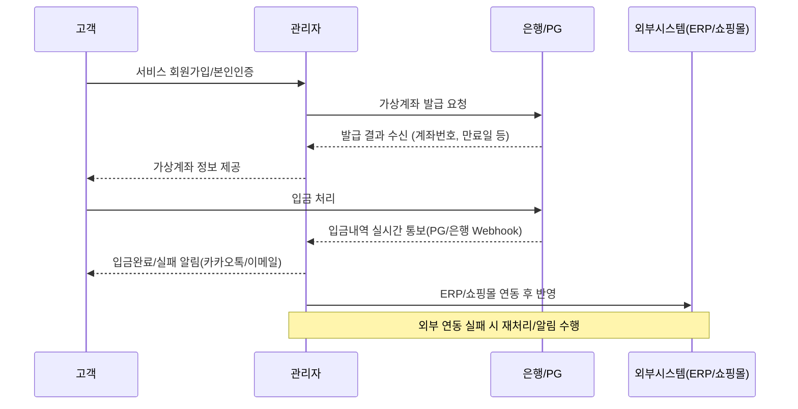

# 2. 주요 사용자 및 유스케이스 정의

이 문서는 신규 백엔드 중심 웹 시스템 내 가상계좌 관리 서비스의 주 사용자(도메인)와 그 사용 시나리오(유스케이스)를 체계적으로 정리합니다. 각 역할별 주요 업무 흐름, 요구사항, 예상 활용 장면이 구체적으로 명시됩니다. 

## 2.1 사용자 도메인 정의

| 역할명      | 정의                                                         | 주요 권한 및 제한                                 |
|------------|--------------------------------------------------------------|---------------------------------------------------|
| 고객        | 서비스 이용을 위해 등록 및 가상계좌를 발급받아 입금하는 최종 사용자 | 본인 계좌 상태/내역 조회, 입금 UI 접근             |
| 관리자      | 고객 계좌 관리, 입금내역 확인, 알림발송, 외부시스템 연동 담당자  | 전체 고객/계좌/입금내역 조회, 필터/검색, 알림관리   |
| 슈퍼관리자* | 시스템 전체 운영 및 관리자 계정 관리(선택적 도입)              | 모든 관리자 권한 + 계정/권한 설정, 로그 감시        |

※ 슈퍼관리자는 운영정책상 필요에 따라 선택적으로 도입 가능합니다.

## 2.2 사용자별 유스케이스 개요

### 1) 고객(Customer)
- 서비스 회원가입 및 본인인증
- 가상계좌(은행/PG 연동 기반) 발급 신청 및 발급 결과 조회
- 안내받은 계좌로 입금(다수 회차 가능, 자동 입금확인)
- 입금 결과/오류 등 알림 수신(카카오톡, 이메일 등)
- 마이페이지에서 입금 내역 및 처리 현황 실시간 확인

### 2) 관리자(Admin)
- 전체/개별 고객 현황, 가상계좌/입금내역 실시간 조회
- 사용자별 검색, 필터, 기간별 통계 추출, 엑셀 다운로드
- 입금/미입금 등 조건별로 카카오톡, 이메일 등 알림 직접 발송 및 관리
- 외부 시스템(ERP/쇼핑몰) 연동 내역 확인 및 반영 여부 관리
- 계좌 만료, 미매칭 등 예외상황 모니터링 및 수동 조치

### 3) 슈퍼관리자(Super Admin, 선택)
- 관리자 계정 생성/삭제, 권한관리, 2차 인증 설정
- 전체 시스템/로그 모니터링 및 감사

## 2.3 핵심 Use Case 상세 (시퀀스 예시)

## 2.4 주요 사용 시나리오(표)

| 시나리오                        | 주요 참여자  | 트리거 및 주요 경로                               |
|-------------------------------|------------|---------------------------------------------|
| 회원가입 및 가상계좌 발급         | 고객, 관리자 | 회원등록 → 본인인증 → 가상계좌 발급 → 안내           |
| 입금 및 자동 입금확인/매칭        | 고객, 관리자 | 고객입금 → 실시간 입금내역 조회/매칭 → 알림         |
| 알림발송(입금완료/실패/만료 등)   | 관리, 고객   | 조건변경 또는 입금 결과 → 카카오톡/이메일 발송      |
| 외부시스템(ERP/쇼핑몰) 연동      | 관리자, 외부 | 입금/상태정보 변경 → ERP/쇼핑몰 API/Webhook 연계    |
| 관리자/슈퍼관리자 권한 관리       | 관리자, 슈퍼 | 권한설정/변경, 2FA 설정, 로그 모니터링             |

## 2.5 비고 및 특이사항
- 알림 미수신, 금액 미일치 등 예외 플로우 반드시 별도로 관리 필요
- 고도화 요구(재입금, 부분환불 등) 접수 시 Use Case 확장
- 향후 연동/통합 업무 문서 추가 가능 ([목차로 이동](./00_virtual_account_toc.md))
