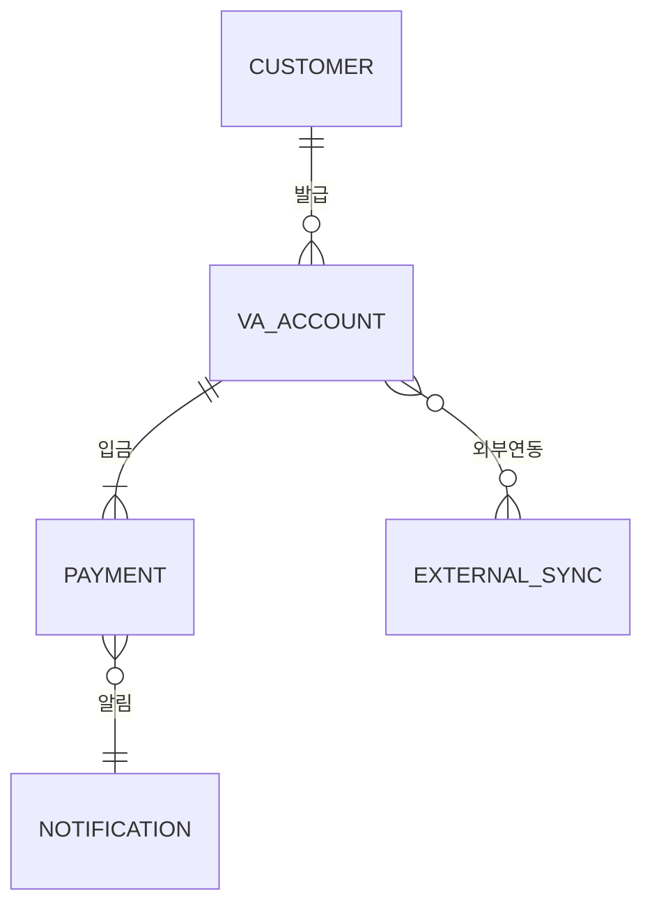

# 03. 가상계좌 발급 및 입금 처리 프로세스 흐름

## 1. 개요
이 문서는 신규 백엔드 중심 가상계좌 시스템의 주요 프로세스(계좌발급, 입금, 매칭, 알림, 외부 연동)에 대한 흐름을 상세히 정리합니다. 시스템의 명확한 운영 및 외부 연동을 지원하며, 고객, 관리자, 외부시스템(은행/PG, ERP, 쇼핑몰) 등 다양한 이해관계자의 요구를 충족합니다.

## 2. 프로세스 전체 흐름도
```
고객 등록
   ↓
가상계좌 발급 (은행/PG 연동)
   ↓
고객 입금(계좌)
   ↓
입금 내역 자동 확인 및 매칭
   ↓
알림 전송(카카오톡, 이메일)
   ↓
외부 시스템 반영(ERP/쇼핑몰)
```
(상세 각 단계 별 Sub Flow는 아래에 기술)

## 3. 주요 단계별 상세 흐름
### 3.1 고객 등록
- 고객이 웹사이트/외부 채널을 통해 회원가입 또는 주문
- 필수 정보: 이름, 연락처, 주문/결제정보 등

### 3.2 가상계좌 발급
- 고객 신청 정보를 바탕으로 은행/PG사 API 연동
- KG이니시스/Toss Payments 예시: API 요청 → 가상계좌 번호 및 기한, 입금 가능 금액 등 정보 수신
- 고객 화면 표출 및 안내

### 3.3 입금 및 내역 확인
- 고객은 발급된 가상계좌로 입금 수행
- 시스템은 은행/PG에서 제공하는 데이터(웹훅/주기 폴링)로 입금 내역 실시간 수신
- 입금 내역(금액, 입금자명, 시간 등) DB 저장

### 3.4 자동 매칭
- 시스템이 고객 주문/등록 정보와 입금 내역 자동 비교
- 입금 금액, 주문금액, 입금자명 등 매칭 로직 적용
- 예외(금액 불일치, 입금자 오표기 등)는 관리자/고객 알림

### 3.5 알림 처리
- 성공/실패/계좌만료/관리자 알림 등 다양한 상황별 알림 시나리오 실행
- 카카오톡, 이메일 등 채널별 알림 선별 전송
- 알림 발송 결과 로그 기록, 실패 시 재시도 로직

### 3.6 외부 시스템 반영
- ERP(더존 iCUBE 등) 및 쇼핑몰(Cafe24, 고도몰)과 API/Webhook 연동
- 입금 확정 정보 전달, 상태 업데이트, 환불 등 다양한 데이터 외부 연동 처리
- 외부 연동 실패/지연 시 관리자 Alert 노출

## 4. 관리자 업무 흐름
- 실시간 대시보드 입금/처리 상황 모니터링
- 필터, 검색, 엑셀 다운로드, 알림 내역 관리
- 예외/오류 발생 시 수동 처리 및 이력 관리

## 5. 프로세스 ERD (예시)


## 6. 프로세스 주요 고려사항
- 입금 데이터 실시간성 & 신뢰성 확보
- 매칭 로직의 신뢰도 및 관리자 개입 최소화
- 외부 연동 장애 대비 재처리/Alert 시나리오 구축
- 개인정보 및 금융 데이터 보안 유의


**[이 문서는 [00_virtual_account_toc.md](./00_virtual_account_toc.md) 및 관련 세부문서에서 세부 기능별로 확장 설명됩니다.]**