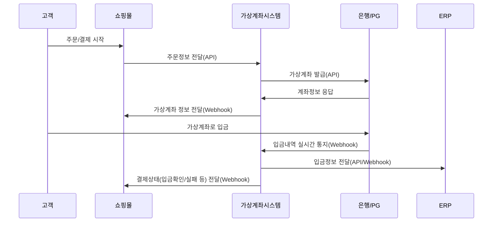

# 04. 가상계좌 외부 연동 명세 (ERP/쇼핑몰/은행/PG)

본 문서는 가상계좌 시스템과 외부 시스템(ERP, 쇼핑몰, 은행/PG) 간의 연동 구조 및 API 설계에 대한 계획 및 요구사항을 상세히 기술합니다. 

## 1. 개요
- **목표:** 은행/PG(예: KG이니시스, Toss Payments), ERP(더존 iCUBE 등), 쇼핑몰(Cafe24, 고도몰)과 실시간/비동기 방식으로 연동하여 가상계좌 발급, 입금확인, 입금정보 외부 반영, 연관 프로세스 자동화 지원을 목적으로 함.
- **주요 사용자:** 고객, 관리자, 외부 시스템(ERP/쇼핑몰 실무자)

## 2. 연동 대상 및 목적
| 외부 시스템 | 연동 목적 | 방식 및 기술 |
| ---- | ---- | ---- |
| 은행/PG사 | 가상계좌 발급, 입금내역 실시간 수신 | API/SDK, Webhook, OAuth2/HMAC 인증 |
| ERP | 입금내역/처리결과 전송, 통합 회계 처리 | REST API, Push/Pull 데이터 동기화 |
| 쇼핑몰 | 주문-입금 연동, 상태 자동 갱신 | Webhook, 상태변경 Push, API 연동 |

## 3. 외부 연동 주요 플로우


## 4. API 명세(개요)
### 4.1 ERP 연동
- **엔드포인트 예시**
    - `POST /erp/v1/payments/deposit`
        - 바디: { order_id, amount, deposit_date, depositor, status }
        - 인증: HMAC 혹은 OAuth2 Bearer
- **Push & Pull 지원:** ERP에서 수시로 입금현황을 질의하거나, 가상계좌시스템이 실시간으로 처리 결과를 Push

### 4.2 쇼핑몰 연동
- **Webhook URL 등록:** 상태 변경 시(계좌발급/입금확인/오류), 사전에 등록된 URL로 POST 알림
- **주요 데이터 필드:** 주문번호, 가상계좌번호, 입금액, 입금상태, 일시
- **예시:**
    ```json
    {
      "order_id": "12345",
      "virtual_account": "110-222-333333",
      "status": "DEPOSIT_CONFIRMED",
      "amount": 50000,
      "deposit_date": "2025-06-16T17:00:00+09:00"
    }
    ```

### 4.3 은행/PG 연동
- **필수 API:**
    - 가상계좌 발급 요청 및 응답
    - 입금내역 실시간 Webhook 수신 및 검증
    - 오류/만료/상태변경 알림 대응
- **인증 방식:** 금융기관 가이드에 따른 OAuth2 혹은 내부 전용 키/HMAC

## 5. 보안 및 장애 대응
- 모든 API는 TLS 기반
- 응답/요청 로그 저장 및 오류시 재처리 큐 운영
- 인증 오류, 데이터 불일치 등에 대한 상세한 에러코드 설계

## 6. 향후 확장 고려점
- 연동 대상 추가(새 은행/PG, 신규 ERP), API 버전 관리 정책
- Webhook 리트라이/순서보장 등 실시간성 강화 정책

---
- [메인 목차로 돌아가기](./00_virtual_account_toc.md)
- [프로세스 플로우 참조](./03_virtual_account_issue_flow.md)


_추가 요구사항이나 세부 명세 요청 사항이 있을 경우 피드백 바랍니다._