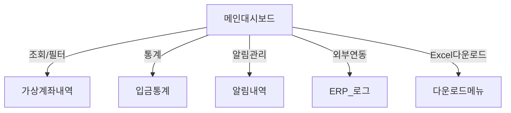

# 관리자 대시보드 설계

## 1. 목적 및 개요
관리자의 효율적인 시스템 운영 지원을 위해, 가상계좌 서비스의 데이터 검토·관리·통계 제공 및 주요 알림 기능을 한눈에 관리할 수 있도록 설계된 "관리자 대시보드"에 대한 요구사항 및 UX 설계 문서입니다.

---

## 2. 주요 기능
- **가상계좌 내역 실시간 조회 및 상태 모니터링**
    - 입금 내역, 계좌 발급/만료 현황, 오류/이상 내역 표시
- **필터 및 검색**
    - 기간, 상태(입금대기/입금완료/만료/오류), 은행/PG사, 고객명, 계좌번호 등 필터 다중 선택
    - 실시간 자동완성(검색어 추천)
- **엑셀(Excel) 다운로드 및 보고서 생성**
    - 조회 결과 엑셀 다운로드
    - 조건별 요약 통계표 자동 생성
- **알림 관리**
    - 입금 확정, 실패, 계좌 만료, 특이사항 발생 시 관리자 및 관련자 알림 발송 내역 열람
    - 알림 수신 대상 및 종류(카카오톡, 이메일 등) 설정/관리
- **외부 연동 현황 확인**
    - ERP/쇼핑몰 반영 여부 로그
    - 전송 실패 건 재시도/수동전송 기능
- **이상 감지 및 대시보드 경고**
    - 미매칭 내역, 대량/반복 오류 등 이상 패턴 경보 표시
- **권한/로그 관리**
    - 관리자/슈퍼관리자별 접근권한 구분, 주요 이력조회

---

## 3. 주요 화면 구성 예시

- **상단 요약**: 전체 건수, 최신 입금/오류, 미매칭 현황 요약 카드
- **중앙**: 상세 테이블 및 필터
- **우측/하위**: 알림 내역·설정, 외부연동 로그

---

## 4. 상세 요구사항 및 UX
### 4.1 조회 및 필터링
- 기본 최근 1개월 데이터 조회(기간 변경 지원)
- 필드별 정렬/검색/다중필터 가능
### 4.2 엑셀/통계 다운로드
- 조회 조건 반영, 다국어(필요시) 지원
### 4.3 알림 설정 및 이력관리
- 조건별 자동알림 정책 추가/수정/ON·OFF
### 4.4 외부 연동 및 상태표시
- ERP, 쇼핑몰 등 외부시스템 전송상태 실시간 표시 및 실패시 재전송 관리
### 4.5 권한별 기능 제한
- 관리자/슈퍼관리자 전용 메뉴 차등 노출

---

## 5. 비기능/시스템 요구사항
- **실시간성**: 3초 내 응답, 5분/실시간 데이터 동기화
- **보안**: 이중인증, 접속로그 추적, 주요변경 알림
- **사용성**: PC 웹 최적화, 모바일 대응(필요시)

---

## 6. 참고 및 관련 문서
- [전체 목차로 돌아가기](./00_virtual_account_toc.md)
- [보안/권한 관리](./07_virtual_account_security.md)
- [외부 연동](./04_virtual_account_external_integration.md)

---

**피드백이나 추가 요청 사항이 있으시면 언제든 말씀해 주세요.**